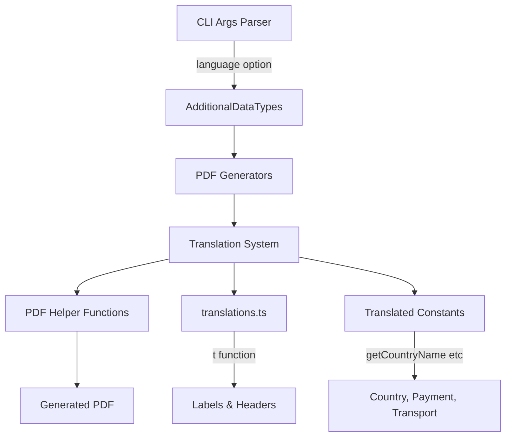

# Add English/Polish Language Support for PDF Generation

## Overview

Implement bilingual PDF generation (Polish/English) for KSeF invoices and UPO documents. All user-facing text on PDFs will be translatable via a `--language` CLI flag, while internal code remains unchanged.

## Architecture



## Implementation Steps

### 1. Create Translation Infrastructure

**Create**: [`src/shared/i18n/translations.ts`](src/shared/i18n/translations.ts)

- Define `Language` type as `'pl' | 'en'`
- Create translation object `T` with all visible PDF strings organized by category:
  - Headers: `header.ksef`, `header.seller`, `header.buyer`, `header.details`, etc.
  - Labels: `label.invoice_number`, `label.issue_date`, `label.eori_number`, etc.
  - Invoice types: `invoice.type.VAT`, `invoice.type.ZAL`, `invoice.type.KOR`, etc.
  - Table columns: `table.lp`, `table.product_name`, `table.quantity`, etc.
  - Messages: `message.attachment_warning`, etc.
- Export `t(key, lang)` helper function for lookups
- Estimated: ~200-300 translation keys needed

**Create**: [`src/shared/i18n/constants.ts`](src/shared/i18n/constants.ts)

- Create English versions of all constants that appear on PDFs:
  - `KrajEN`: All 275 country names
  - `FormaPlatnosciEN`: Payment forms (7 entries)
  - `RodzajTransportuEN`: Transport types (8 entries)
  - `ProceduraEN`: Procedures (7 entries)
  - `TypKorektyEN`: Correction types (3 entries)
  - `TAXPAYER_STATUS_EN`: Taxpayer statuses (4 entries)
  - All role mappings for FA1/FA2/FA3
- Export helper functions: `getCountryName(code, lang)`, `getFormaPlatnosci(code, lang)`, etc.

### 2. Update Type Definitions

**Modify**: [`src/lib-public/types/common.types.ts`](src/lib-public/types/common.types.ts)

```typescript
export interface AdditionalDataTypes {
  nrKSeF?: string;
  qrCode1?: string;
  qrCode2?: string;
  isMobile?: boolean;
  language?: "pl" | "en"; // ADD THIS - defaults to 'pl'
}
```

**Modify**: [`src/cli/types.ts`](src/cli/types.ts)

```typescript
export interface CliOptions {
  input: string;
  output: string;
  type: "invoice" | "upo";
  nrKSeF?: string;
  qrCode1?: string;
  qrCode2?: string;
  language?: "pl" | "en"; // ADD THIS
}
```

### 3. Update CLI Argument Parser

**Modify**: [`src/cli/args.ts`](src/cli/args.ts)

- Add case for `--language` / `-l` flag in the switch statement (around line 76)
- Validate value is either 'pl' or 'en'
- Default to 'pl' if not specified

**Modify**: [`src/cli/commands.ts`](src/cli/commands.ts)

- Update `printHelp()` to document the new `--language` flag

**Modify**: [`src/cli/main.ts`](src/cli/main.ts)

- Pass `language` from CLI options to `additionalData` object when calling generators

### 4. Update PDF Helper Functions

**Modify**: [`src/shared/PDF-functions.ts`](src/shared/PDF-functions.ts)

Update these functions to accept and use language parameter:

```typescript
createHeader(textKey: string, margin?: Margins, language: Language = 'pl'): Content[]
createSubHeader(textKey: string, margin?: Margins, language: Language = 'pl'): Content[]
createLabelText(labelKey: string, value, formatTyp, style, language: Language = 'pl'): Content[]
createLabelTextArray(data: CreateLabelTextData[], language: Language = 'pl'): Content[]
```

All these functions should:

- Import `t` from translations
- Translate the key using `t(textKey, language)` before rendering
- Maintain backward compatibility with default 'pl'

### 5. Update Common Generators

**Modify**: [`src/lib-public/generators/common/Naglowek.ts`](src/lib-public/generators/common/Naglowek.ts)

- Extract language from `additionalData?.language || 'pl'`
- Translate invoice type names using `t('invoice.type.{TYPE}', lang)`
- Translate "Krajowy System e-Faktur" header
- Translate "Numer Faktury:", "Numer KSEF:" labels
- Translate attachment warning message

**Modify**: [`src/lib-public/generators/common/Stopka.ts`](src/lib-public/generators/common/Stopka.ts)

- Add language parameter
- Translate QR code labels and footer text

**Modify**: [`src/lib-public/generators/common/DaneFaKorygowanej.ts`](src/lib-public/generators/common/DaneFaKorygowanej.ts)

- Add language parameter
- Translate correction data labels

**Modify**: [`src/lib-public/generators/common/Rozliczenie.ts`](src/lib-public/generators/common/Rozliczenie.ts)

- Add language parameter
- Translate settlement labels

### 6. Update FA1 Generators (16 files)

**Modify**: [`src/lib-public/generators/FA1/Podmioty.ts`](src/lib-public/generators/FA1/Podmioty.ts)

- Extract language from invoice/additionalData
- Pass to all sub-generators

**Modify**: [`src/lib-public/generators/FA1/Podmiot1.ts`](src/lib-public/generators/FA1/Podmiot1.ts)

- Add `language: Language` parameter
- Use `t('header.seller', lang)` for header
- Translate all labels: EORI, VAT prefix, address, contact, taxpayer status

**Modify**: [`src/lib-public/generators/FA1/Podmiot2.ts`](src/lib-public/generators/FA1/Podmiot2.ts)

- Add language parameter
- Use `t('header.buyer', lang)` for header
- Translate all buyer labels

**Modify**: [`src/lib-public/generators/FA1/Podmiot3.ts`](src/lib-public/generators/FA1/Podmiot3.ts)

- Add language parameter
- Translate entity role labels using translated role mappings

**Modify**: [`src/lib-public/generators/FA1/Szczegoly.ts`](src/lib-public/generators/FA1/Szczegoly.ts)

- Add language parameter
- Use `t('header.details', lang)`
- Translate all detail labels: invoice number, issue date, place, dates, currency, exchange rate

**Modify**: [`src/lib-public/generators/FA1/Wiersze.ts`](src/lib-public/generators/FA1/Wiersze.ts)

- Add language parameter
- Translate table headers: Lp., product name, quantity, unit price, discount, VAT rate, etc.
- Translate "Faktura wystawiona w cenach..." text
- Translate payment amount labels

**Modify**: [`src/lib-public/generators/FA1/Zamowienie.ts`](src/lib-public/generators/FA1/Zamowienie.ts)

- Add language parameter
- Use `t('header.order', lang)`
- Translate order table headers

**Modify**: [`src/lib-public/generators/FA1/Rabat.ts`](src/lib-public/generators/FA1/Rabat.ts)

- Add language parameter
- Translate discount table headers and labels

**Modify**: [`src/lib-public/generators/FA1/PodsumowanieStawekPodatkuVat.ts`](src/lib-public/generators/FA1/PodsumowanieStawekPodatkuVat.ts)

- Add language parameter
- Translate VAT summary table headers

**Modify**: [`src/lib-public/generators/FA1/Platnosc.ts`](src/lib-public/generators/FA1/Platnosc.ts)

- Add language parameter
- Use `t('header.payment', lang)`
- Translate payment form using `getFormaPlatnosci(code, lang)`
- Translate all payment labels

**Modify**: [`src/lib-public/generators/FA1/WarunkiTransakcji.ts`](src/lib-public/generators/FA1/WarunkiTransakcji.ts)

- Add language parameter
- Translate transaction terms labels

**Modify**: [`src/lib-public/generators/FA1/Transport.ts`](src/lib-public/generators/FA1/Transport.ts)

- Add language parameter
- Translate transport type using `getRodzajTransportu(code, lang)`
- Translate all transport labels

**Modify**: [`src/lib-public/generators/FA1/Adnotacje.ts`](src/lib-public/generators/FA1/Adnotacje.ts)

- Add language parameter
- Translate annotations labels

**Modify**: [`src/lib-public/generators/FA1/DodatkoweInformacje.ts`](src/lib-public/generators/FA1/DodatkoweInformacje.ts)

- Add language parameter
- Translate additional information labels

**Modify all FA1 sub-generators** (Adres, PodmiotAdres, PodmiotDaneIdentyfikacyjne, PodmiotDaneKontaktowe, PodmiotUpowazniony, Przewoznik, etc.)

- Add language parameter to function signatures
- Pass through to nested calls

### 7. Update FA2 Generators (Similar to FA1, ~18 files)

Apply same pattern as FA1 to all FA2 generators:

- [`src/lib-public/generators/FA2/Podmioty.ts`](src/lib-public/generators/FA2/Podmioty.ts)
- [`src/lib-public/generators/FA2/Podmiot1.ts`](src/lib-public/generators/FA2/Podmiot1.ts)
- [`src/lib-public/generators/FA2/Podmiot2.ts`](src/lib-public/generators/FA2/Podmiot2.ts)
- [`src/lib-public/generators/FA2/Podmiot3.ts`](src/lib-public/generators/FA2/Podmiot3.ts)
- [`src/lib-public/generators/FA2/Szczegoly.ts`](src/lib-public/generators/FA2/Szczegoly.ts)
- [`src/lib-public/generators/FA2/Wiersze.ts`](src/lib-public/generators/FA2/Wiersze.ts)
- All other FA2 sub-generators following same pattern

### 8. Update FA3 Generators (Similar to FA1/FA2, ~20 files)

Apply same pattern to all FA3 generators:

- [`src/lib-public/generators/FA3/Podmioty.ts`](src/lib-public/generators/FA3/Podmioty.ts)
- [`src/lib-public/generators/FA3/Podmiot1.ts`](src/lib-public/generators/FA3/Podmiot1.ts)
- [`src/lib-public/generators/FA3/Podmiot2.ts`](src/lib-public/generators/FA3/Podmiot2.ts)
- [`src/lib-public/generators/FA3/Podmiot3.ts`](src/lib-public/generators/FA3/Podmiot3.ts)
- [`src/lib-public/generators/FA3/Szczegoly.ts`](src/lib-public/generators/FA3/Szczegoly.ts)
- [`src/lib-public/generators/FA3/Wiersze.ts`](src/lib-public/generators/FA3/Wiersze.ts)
- All other FA3 sub-generators following same pattern

### 9. Update UPO Generators (3 files)

**Modify**: [`src/lib-public/generators/UPO4_2/Naglowek.ts`](src/lib-public/generators/UPO4_2/Naglowek.ts)

- Add language parameter
- Translate "Krajowy System e-Faktur"
- Translate UPO-specific labels

**Modify**: [`src/lib-public/generators/UPO4_2/Dokumenty.ts`](src/lib-public/generators/UPO4_2/Dokumenty.ts)

- Add language parameter
- Translate document labels

**Modify**: [`src/lib-public/UPO-4_2-generators.ts`](src/lib-public/UPO-4_2-generators.ts)

- Pass language through to sub-generators

### 10. Update Top-Level Generator Entry Points

**Modify**: [`src/lib-public/FA1-generator.ts`](src/lib-public/FA1-generator.ts)

- Extract `const lang = additionalData?.language || 'pl'`
- Pass `lang` to all generator function calls

**Modify**: [`src/lib-public/FA2-generator.ts`](src/lib-public/FA2-generator.ts)

- Same pattern as FA1

**Modify**: [`src/lib-public/FA3-generator.ts`](src/lib-public/FA3-generator.ts)

- Same pattern as FA1

**Modify**: [`src/lib-public/UPO-4_2-generators.ts`](src/lib-public/UPO-4_2-generators.ts)

- Same pattern as FA1

### 11. Update Shared Constants

**Modify**: [`src/shared/consts/const.ts`](src/shared/consts/const.ts)

- Keep existing Polish constants unchanged
- Import translation helpers from `i18n/constants.ts`
- Update `getTaxpayerStatusDescription` to accept language parameter

### 12. Update README and Documentation

**Modify**: [`readme.md`](readme.md)

- Add documentation for `--language` flag
- Show examples of generating PDFs in English

**Modify**: [`docs/TESTING.md`](docs/TESTING.md)

- Add test cases for both languages

### 13. Testing

- Test all invoice types (FA1, FA2, FA3) in both languages
- Test UPO generation in both languages
- Verify backward compatibility (no language specified = Polish)
- Verify all constants are translated correctly
- Check table headers, labels, and dynamic content

## Key Implementation Notes

1. **Backward Compatibility**: Default language is 'pl', so existing usage continues to work
2. **No Code Refactoring**: Function names, variables, comments stay in Polish
3. **Consistent Pattern**: All generators follow same pattern: accept language param, pass to helpers
4. **Type Safety**: Use TypeScript's type system to ensure language param is passed correctly
5. **Testability**: Language choice is explicit in AdditionalDataTypes, easy to test

## Translation Coverage

Total estimated translation keys: ~200-300 strings covering:

- 15+ section headers
- 100+ field labels
- 10+ invoice types
- 50+ table column headers
- 275 country names
- 30+ enum value translations (payment forms, transport types, procedures, roles)
- Various messages and warnings